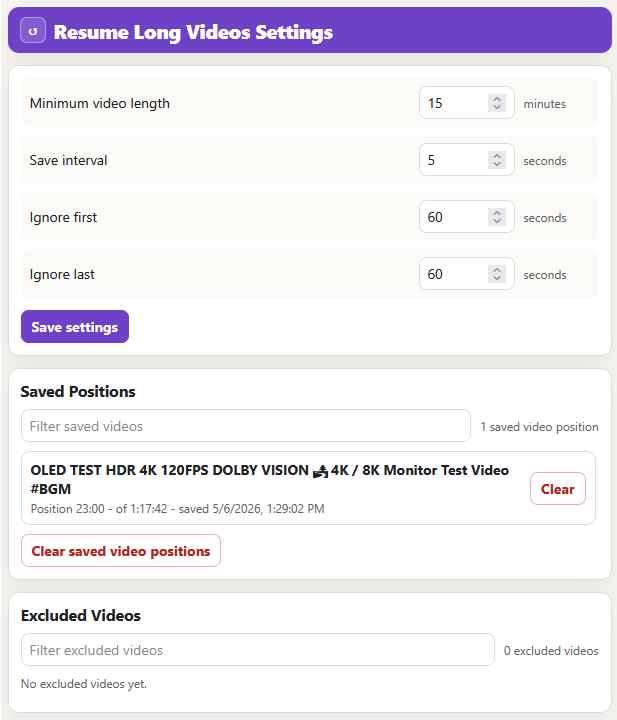

# Resume Long Videos

Resume Long Videos automatically saves your playback position on longer YouTube videos and jumps back to where you left off.

It is customizable, so you can choose the minimum video length, save interval, and which parts of a video should be ignored.

## Features

- Resumes playback position when you return to a video
- Only tracks videos longer than your configured minimum length
- Per-video exclusion — disable saving for specific videos
- View and clear saved positions from the options page
- View and restore excluded videos from the options page

## Customization

All settings are configurable from the options page:

| Setting | Default | Description |
|---|---:|---|
| Minimum video length | 15 min | Only track videos at least this long |
| Save interval | 5 sec | How often the position is saved while watching |
| Ignore first | 60 sec | Do not save if you are within the first N seconds |
| Ignore last | 60 sec | Do not save if you are within the last N seconds of the video |

## Privacy

Resume Long Videos stores saved video positions, excluded videos, video titles, video durations, and settings locally in your browser using extension storage.

The extension does not send your video IDs, video titles, watch history, saved positions, excluded videos, settings, or any other data to external servers.
